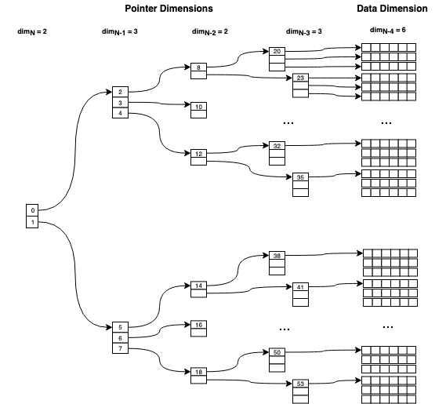

```
 ╦ ╦┬ ┬┌─┐┌─┐┬─┐  ╔╗ ┬ ┬┌─┐┌─┐┌─┐┬─┐
 ╠═╣└┬┘├─┘├┤ ├┬┘  ╠╩╗│ │├┤ ├┤ ├┤ ├┬┘
 ╩ ╩ ┴ ┴  └─┘┴└─  ╚═╝└─┘└  └  └─┘┴└─

```

### A C++ structure to manage multi-dimensional data efficiently and safely


&nbsp;&nbsp;&nbsp;&nbsp;&nbsp;&nbsp;&nbsp;&nbsp;&nbsp;&nbsp;&nbsp;&nbsp;&nbsp;&nbsp;&nbsp;&nbsp;&nbsp;&nbsp;&nbsp;&nbsp;&nbsp;
[](https://travis-ci.com/Sidelobe/HyperBuffer)
[](https://travis-ci.com/Sidelobe/HyperBuffer)

The main use case for this container is to hold dynamically-allocated N-dimensional datasets in memory and provide convenient access to it, while minimizing performance/memory overhead and unnecessary dynamic allocation.

### Main design paradigms and parameters:

* **data types**: defined at compile-time (template argument), identical for all dimensions
* **number of dimensions** : defined at compile-time (template argument)
* **extent of these dimensions**: defined at run-time, but cannot be changed once the object is constructed: `HyperBuffer` is non-resizable.

>NOTE: For the time being, I've constrained all dimensions to be uniform, i.e. each 'slice' in a given dimension has equal length.

API requirements:

* need to be able to provide a raw pointer (e.g. `float***` to the data)
* support initializer lists

Memory management requirements:

* no dynamic allocation after construction ('owning' mode only)
* no dynamic allocation at all (all modes except 'owning')
* dynamic allocation-free move() semantics
* alignment of the data (lowest-order dimension) can be specified ('owning' mode only)
 

```

TBD : code examples


```

#### Requirements / Compatibility
 - C++14, STL
 - tested with GCC 7 and clang 11


 
### Data Access Modes
There are several

#### Owning


#### Pre-Allocated Multi-Dimensional (MultDim View)

#### Pre-Allocated Flat (Flat View)

### Memory Model for 'Owning' Mode
In C++/C, there are two common ways of allocating a multi-dimensional data structure:

1. **contiguous / linear**: e.g. C-Style `int[2][3][5]`, which is just 'view' for a 1D `2*3*5` int array. All dimensions have to be uniform, alignment is achieved through padding. Other than this, there is zero memory overhead, unless you need to produce an `int***` to the data.

1. **linked / pointer**: arrays of pointers that point to other pointers and eventually the data. Dimensions can be non-uniform, data alignment can be achieved when allocating the lowest-order dimension.

Essentially, with method \#2 we differentiate between the memory required for pointers and the memory used for the actual data, which is located at the lowest dimension. Allocating the memory for the pointers usually involves individual allocation on every dimension recursively.

This also entails recursive (de-)allocation when copying or moving such a multidimensional data structure. For this reason, a linear memory model was chosen in this project, where both the data and all the pointers are stored linearly in a 'flat' array each.

This way, only 2 one-dimensional arrays (or similar data structure) need be allocated, regardless of the order of dimensions: one for the data, and one for the pointers.

#### Self-Referencing Pointer Array
This array contains the entire pointer data required for a multi-dimensional buffer. The pointers are stored contiguously within every dimension, which allows for proper dereferencing / arithmetics when accessing the data through them. The pointers for each dimension point to the respective pointers in the next dimension, except for the 2nd-to-lowest dimension pointers, which point at the data.

Here's an example for a 5-Dimensional buffer with the extents `{2, 3, 2, 3, 6}`. The indices(0-55) represent the position of these pointers in pointer array.



### Memory Overhead & Buffer Geometry
The memory overhead of an N-Dimensional `HyperBuffer` of `base_type` has 2 components:

1. The amount of memory required for the **data** is given by the *product of all its dimension extents*. This corresponds to the amount of elements in the lowest-order dimension.

1. The **amount of pointers** need for a given multi-dimensional buffer is given by the *sum of the cumulative product of its dimension extents*, where with 'dimensions' we mean the 'pointer dimensions', i.e. we ignore the lowest-order dimension.

For a `HyperBuffer<float, 3>(2, 4, 5)` this would mean:

* `2*4*5 * sizeof(float) = 160 Bytes` for the data
* `(2 + 2*4) * sizeof(float*) = 80 Bytes` for the pointers (on a 64-bit machine)


### Lessons Learned: Unwanted Dynamic Memory Allocation

Since we could potentially use any data structure for both the pointers and data, `std::vector<>` is an obvious candidate. However, the default constructor `std::vector<>` will allocate in some STL implementations, and not in others)!

The Microsoft Visual Studio Compiler (MSVC) allocates dynamic memory in the default constructors of some STL containers. This leads to unwanted allocation in move semantics, where the default constructor is implicitly called by the compiler at some point in the process. This has pushed us to avoid using STL containers in these scenarios.

 According to [https://stackoverflow.com/a/48744563/649700]() this happens when `_ITERATOR_DEBUG_LEVEL` is set to 1 or 2, which is the default setting for debug builds. Also cf. [https://docs.microsoft.com/en-us/cpp/standard-library/iterator-debug-level?view=vs-2019]()


